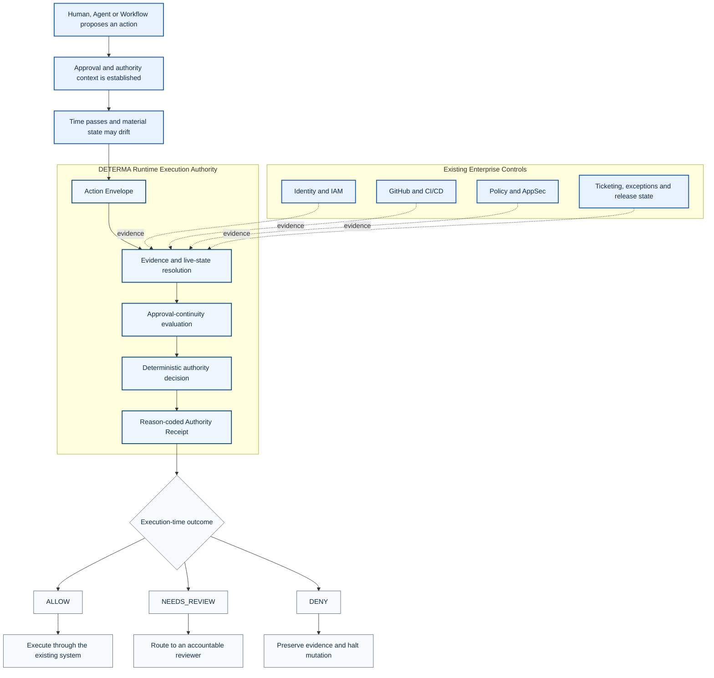

# DETERMA Runtime Authority


**Public category and architecture surface for execution-time legitimacy in autonomous systems.**

DETERMA addresses one narrow but consequential question:

> Is this exact action still authorized to execute now?

Approval, identity, permissions, policy checks and CI results remain necessary. DETERMA focuses on continuity between the authority granted earlier and the exact artifact, target and live state presented at execution time.

## Repository Boundary

| Dimension | Classification |
|---|---|
| Repository role | Public explanation and category architecture |
| Runtime authority | None |
| Mutation capability | None |
| Customer deployment claim | None |
| Intended audience | Engineering, Security, Platform, Architecture and Design Partners |

This repository explains the category and public runtime model. It intentionally excludes implementation-bearing authority code, private diligence artifacts and unreleased enforcement mechanics.

## Enterprise Architecture View



### What the diagram means

1. Existing systems remain authoritative for identity, permissions, workflow state, policy findings and source records.
2. DETERMA normalizes the proposed action and the supporting evidence into an action-level decision context.
3. Material evidence is resolved again at the execution checkpoint.
4. The output is deterministic, explainable and accompanied by a receipt.
5. `NEEDS_REVIEW` is the canonical reviewer-routing outcome; it does not authorize execution.
6. Execution still occurs through the existing enterprise system or a separately governed executor.

## Core Runtime Failure

```text
Approved earlier
!=
Legitimate now
```

State can change between approval and execution:

- artifact or commit movement;
- target or environment change;
- policy, waiver or release-state change;
- concurrent mutation;
- stale runtime witness;
- replay of a consumed authority grant.

## Runtime Flow

```text
proposal
-> approval context
-> runtime drift window
-> evidence and live-state resolution
-> legitimacy recomputation
-> ALLOW, NEEDS_REVIEW or DENY
-> reason-coded receipt
```

## Runtime Concepts

- [Why approval is insufficient](docs/runtime/why-approval-is-insufficient.md)
- [Runtime legitimacy](docs/runtime/runtime-legitimacy.md)
- [Runtime legitimacy sequence](docs/runtime/runtime-sequence.md)
- [Mutation commit integrity](docs/runtime/mutation-commit-integrity.md)
- [Runtime drift failures](docs/runtime/runtime-drift-failures.md)

## Failure Examples

- [Stale approval](docs/examples/stale-approval.md)
- [Replay authority](docs/examples/replay-authority.md)
- [Topology drift](docs/examples/topology-drift.md)
- [CI/CD runtime drift](docs/examples/ci-cd-runtime-drift.md)

## Public Demo

- [Canonical MVP demo](docs/mvp/canonical-demo.md)
- [Public demo](PUBLIC_DEMO.md)

## Truth Boundary

This repository does **not** claim:

- a production-deployed enterprise control plane;
- customer validation or an active customer pilot;
- universal coverage of every execution path;
- a packaged customer-hosted deployment;
- replacement of IAM, CI/CD, AppSec, policy engines or human approval.

## Core Sentence

**Permissions define what an identity may do in principle. DETERMA evaluates whether this exact action is still authorized now.**
