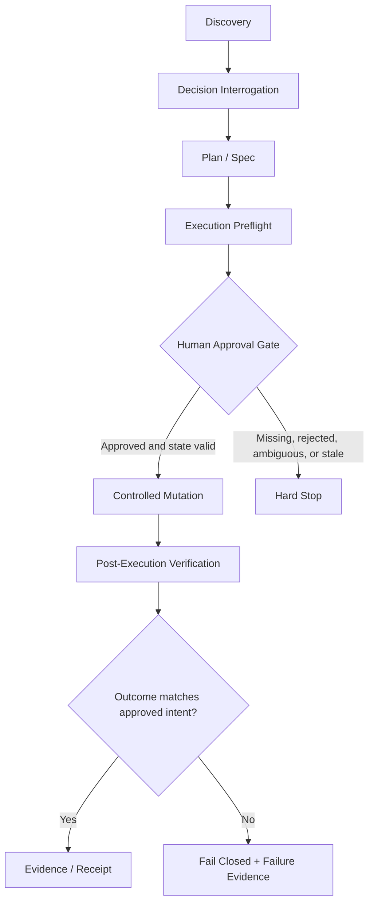

<div align="center">

# DETERMA | EXECUTION AUTHORITY

## EXECUTION PREFLIGHT

### The gate between a good plan and an authorized change

**PUBLIC METHODOLOGY · v0.1 · JULY 2026**  
**Owner: Idan Plaut**

</div>

> [!IMPORTANT]
> **Classification:** `PROVISIONAL PUBLIC METHODOLOGY — NOT BINDING CANON`  
> This document is a conceptual operating framework. It does not claim that any specific system is production-ready, deployed, or fully implemented.

> [!NOTE]
> **Core proposition**  
> A plan may be technically brilliant and still not be authorized to execute.

---

## Document control

| Field | Value |
|---|---|
| Document | Execution Preflight |
| Category | Runtime Execution Authority methodology |
| Owner | Idan Plaut |
| Version | 0.1 |
| Date | July 2026 |
| Status | Provisional public methodology |
| Authority effect | None — this document grants no execution authority |
| Canonical status | Not Binding Canon |
| Companion edition | [Google Docs enterprise edition](https://docs.google.com/document/d/1knEoHjaTn1kqWI3aXPJjQmfH5slZal4bqwMO13cL0Cg) |

---

## The value in 30 seconds

Most engineering teams ask whether a plan is correct:

- Is the architecture sound?
- Were the edge cases considered?
- Are the requirements complete?
- Did the agent inspect the relevant code?

Those questions matter, but they answer only half of the problem.

Before allowing an AI agent to build, modify a repository, open a pull request, update a database, or invoke an API that changes state, I run two distinct processes:

1. **Decision Interrogation** — systematically expose assumptions, alternatives, and hidden decisions.
2. **Execution Preflight** — determine whether the exact proposed action is authorized to execute now.

| Process | Governing question | Primary output |
|---|---|---|
| Decision Interrogation | **Did we decide correctly?** | An explicit plan |
| Execution Preflight | **Is this exact action still authorized to execute now?** | A bounded execution contract |

These are not two versions of the same checklist. They address different failure classes.

---

## Reading paths

- **Executive / CTO / CISO:** read *The value in 30 seconds*, *The control model*, *Hard stops*, and *Adoption levels*.
- **Engineering / Platform:** read *The nine control surfaces*, *Recommended flow*, and the *Minimal contract template*.
- **AI Governance / Risk:** read *Authority boundaries*, *Evidence contract*, and *Failure indicators*.
- **Agent builders:** copy the YAML template and bind it to live state before mutation.

## Contents

1. [The failure: assumption silently becoming authority](#the-failure-assumption-silently-becoming-authority)
2. [Definition](#definition)
3. [The control model](#the-control-model)
4. [Decision Interrogation vs. Execution Preflight](#decision-interrogation-vs-execution-preflight)
5. [The nine control surfaces](#the-nine-control-surfaces)
6. [Recommended execution flow](#recommended-execution-flow)
7. [Minimal Execution Preflight contract](#minimal-execution-preflight-contract)
8. [Worked example: bounded pull-request repair](#worked-example-bounded-pull-request-repair)
9. [Failure indicators](#failure-indicators)
10. [Three adoption levels](#three-adoption-levels)
11. [The governing principle](#the-governing-principle)

---

## The failure: assumption silently becoming authority

The most expensive failures do not always begin with bad code. They often begin with quiet assumptions:

- “It is probably fine to update this additional file.”
- “The branch still looks the same.”
- “The approval from earlier is probably still valid.”
- “The user said proceed, so execution must be allowed.”
- “The tests passed, therefore the change was authorized.”
- “The agent needs broad credentials to finish the task.”

Each statement contains a dangerous transition:

```text
ASSUMPTION  →  DECISION  →  AUTHORITY  →  MUTATION
```

An unexamined assumption becomes a decision. An implicit decision becomes permission. Ambiguous permission becomes real mutation.

**Execution Preflight exists to break that chain before state changes.**

---

## Definition

> [!TIP]
> **Execution Preflight is a bounded execution contract created or validated immediately before mutation.**

It defines:

- the exact target;
- the target's current state;
- the exact action allowed;
- the permitted scope;
- explicitly forbidden actions;
- invariants that must remain true;
- hard-stop conditions;
- the constrained executor permitted to act;
- the evidence required to prove that execution matched approval.

### Mutation is broader than code

Mutation includes:

- file changes;
- commits and branches;
- pull requests, comments, reviews, and thread resolution;
- CI configuration and workflow actions;
- deployments;
- database writes and migrations;
- Drive or document edits;
- permissions and secrets;
- external API calls that create or alter state.

A system that governs only source-code writes governs only a fraction of the actual execution surface.

---

## The control model

Execution Preflight separates six concepts that are frequently collapsed:

| Object | Purpose | Must not be treated as |
|---|---|---|
| Proposal | Describes a desired action | Permission to mutate |
| Decision | Selects a plan or approach | Runtime authority |
| Approval | Accepts an explicit bounded scope | Unlimited or permanent permission |
| Execution contract | Binds action, state, target, executor, and limits | A general instruction |
| Constrained executor | Performs the exact released action | A policy authority or general agent |
| Evidence / receipt | Proves what occurred | Retroactive authorization |

> [!WARNING]
> **Validation is not authority.** Passing tests may prove that code behaves as tested. It does not prove that the change was authorized, correctly scoped, or executed against the approved state.

---

## Decision Interrogation vs. Execution Preflight

| Dimension | Decision Interrogation | Execution Preflight |
|---|---|---|
| Core question | Did we decide correctly? | Is this exact action authorized now? |
| Focus | Assumptions, alternatives, decisions | Scope, state, authority, executor, evidence |
| Output | Explicit plan | Bounded execution contract |
| Typical failure prevented | Missing or incorrect decision | Unauthorized or over-broad mutation |
| Timing | During planning | Immediately before mutation |
| Stop condition | A material decision is unresolved | Authority, scope, state, or verification is invalid |

**Decision Interrogation turns assumptions into explicit decisions.**  
**Execution Preflight prevents decisions from automatically becoming authority.**

---

## The nine control surfaces

### 1. Exact target

Identify the target without ambiguity:

- repository;
- branch;
- pull request;
- database or environment;
- document;
- API resource;
- account;
- file path;
- commit SHA.

“The project repository” is not an exact target. A full repository identifier, branch, pull request number, and expected head SHA are.

**Control outcome:** every mutation is bound to one resolvable target identity.

### 2. Current-state binding

Approval is granted relative to a particular state. If the state changes, the approval may no longer apply.

Bind the operation to evidence such as:

- current commit SHA;
- file hashes;
- pull-request state;
- changed-file set;
- unresolved review threads;
- CI status;
- database version;
- deployment revision;
- permission state.

Approval granted yesterday is not necessarily approval to execute against state that changed this morning.

**Control outcome:** state drift invalidates stale authority rather than silently inheriting it.

### 3. Exact allowed scope

Define positively what may change.

**Avoid:**

> Update the document as needed.

**Prefer:**

> Modify this exact file only, and only the explicitly listed subjects.

A strong scope identifies:

- allowed files and resources;
- allowed fields;
- allowed operation classes;
- permitted semantic changes;
- expected result;
- maximum attempts.

Anything omitted from scope is not implied permission.

**Control outcome:** absence from the allowlist means deny, not discretion.

### 4. Explicit forbidden actions

Define what must not occur, for example:

- no merge;
- no deployment;
- no comments;
- no review-thread resolution;
- no dependency changes;
- no formatting sweep;
- no unrelated refactor;
- no secret access;
- no permission changes;
- no additional files.

Agents often try to help beyond the task. In a governed system, initiative outside scope is not a bonus. It is a violation.

**Control outcome:** helpful overreach becomes machine-detectable scope breach.

### 5. Preserved invariants

An invariant must remain true before, during, and after execution.

Examples:

- the pull request remains Draft;
- the changed-file count remains one;
- an unrelated branch remains unchanged;
- approval cannot be replayed;
- audit remains append-only;
- the executor receives no general shell;
- required CI passes;
- unrelated review threads remain unchanged.

A requirement describes what should be created. An invariant describes what must not be broken while creating it.

**Control outcome:** success requires both the requested result and preservation of protected state.

### 6. Hard-stop conditions

Define in advance when execution must stop rather than “work around” uncertainty.

Hard stops include:

- SHA mismatch;
- branch drift;
- dirty working tree;
- unexpected file changes;
- ambiguous scope;
- missing or mismatched approval;
- failed CI where success is required;
- a new review thread that changes requirements;
- missing target;
- unavailable audit;
- credentials broader than required;
- unavailable post-execution verification.

> [!CAUTION]
> **Fail-closed is not inflexibility. It is a deliberate refusal to convert uncertainty into permission.**

**Control outcome:** ambiguity and drift terminate execution before mutation.

### 7. Fresh and bounded authority

Human approval is necessary, but the word “approved” alone is not a complete execution contract.

Effective authority should be:

- bound to an exact target;
- bound to exact state;
- limited in time;
- limited to one action class;
- limited to one executor;
- single-use where required;
- impossible to broaden through inference.

A general instruction such as “proceed” may authorize further analysis or discovery. It does not automatically authorize undefined mutation.

**Control outcome:** authorization is narrow, current, non-replayable, and non-expandable.

### 8. Constrained executor

The component that decides should not be the component that performs unrestricted mutation.

The executor should receive only the capability required for the exact action, such as:

- editing one approved file;
- opening one Draft PR;
- running one signed migration;
- updating one specific API resource.

It should not receive:

- a general shell;
- a broad organization token;
- access to every repository;
- authority to expand scope;
- the ability to approve its own output.

> [!IMPORTANT]
> **A capable agent is not automatically an authorized executor.**

**Control outcome:** execution power is domain-specific and mechanically limited.

### 9. Post-execution evidence

Success is not “the command completed without an exception.”

Success is evidence that the action performed matches the action approved.

Possible evidence includes:

- resulting commit SHA;
- exact changed-file list;
- actual diff;
- CI result;
- pull-request state;
- database receipt;
- deployment revision;
- API response and readback;
- audit record;
- before-and-after hashes;
- verification result.

The evidence contract must be defined before execution. Otherwise, it is too easy to select convenient evidence after the fact.

**Control outcome:** approved intent and actual outcome become objectively comparable.

---

## Recommended execution flow



Each stage has a separate responsibility:

| Stage | Responsibility |
|---|---|
| Discovery | Observe live reality and collect state |
| Decision Interrogation | Expose assumptions and decisions |
| Plan / Spec | Define the desired action |
| Execution Preflight | Define authority boundaries and stop conditions |
| Human Approval Gate | Approve explicit bounded scope |
| Controlled Mutation | Execute through a constrained adapter |
| Verification | Compare approved intent with actual outcome |
| Evidence / Receipt | Prove what happened |

No stage should impersonate the next:

```text
PLAN ≠ APPROVAL
APPROVAL ≠ EXECUTION
EXECUTION ≠ VERIFICATION
VERIFICATION ≠ AUTHORITY
```

---

## Minimal Execution Preflight contract

Copy and adapt this template. Values must be derived from live state, not assumed.

```yaml
execution_preflight:
  contract_version: "0.1"
  operation_id: ""

  target:
    system: ""
    repository: ""
    branch: ""
    pull_request: ""
    resource: ""
    expected_state:
      head_sha: ""
      file_hashes: {}
      changed_files: []
      status: ""
      observed_at: ""

  allowed_scope:
    operations: []
    files: []
    fields: []
    semantic_changes: []
    expected_result: ""
    max_attempts: 1

  forbidden_actions:
    - scope_expansion
    - unrelated_changes
    - permission_changes
    - secret_access
    - merge
    - deployment

  invariants: []

  hard_stops:
    - target_state_drift
    - ambiguous_scope
    - missing_or_mismatched_approval
    - unexpected_changed_file
    - unavailable_verification
    - audit_failure

  authority:
    approver: ""
    approved_scope_hash: ""
    bound_state_hash: ""
    valid_until: ""
    single_use: true

  executor:
    type: ""
    identity: ""
    allowed_capabilities: []
    prohibited_capabilities: []

  validation:
    pre_execution: []
    immediate_pre_mutation_revalidation: []
    post_execution: []

  required_evidence:
    - resulting_state
    - resulting_sha
    - actual_changed_files
    - actual_diff
    - validation_results
    - final_target_state
    - execution_receipt
```

### Contract acceptance test

The preflight is incomplete unless every answer is explicit:

- **Target:** exactly what will change?
- **State:** against which observed state is authority valid?
- **Allowed:** which operations and resources are permitted?
- **Forbidden:** what must not happen?
- **Invariants:** what must remain true?
- **Stops:** what invalidates execution?
- **Authority:** who approved which exact scope, until when, and for how many uses?
- **Executor:** which constrained identity may act?
- **Evidence:** what readback will prove conformance?

---

## Worked example: bounded pull-request repair

### Target

- Repository: `example-org/runtime-governance`
- Pull request: `#317`
- Branch: `codex/atomic-release-invocation-contract-v0`
- Expected head SHA: `091dec...`

### Allowed

- Edit one approved file only.
- Clarify only the approved contract subjects.
- Commit and push to the existing branch.

### Forbidden

- No code changes.
- No SQL changes.
- No workflow changes.
- No comments.
- No Ready for Review.
- No merge.
- No other pull-request mutation.

### Invariants

- Pull request remains OPEN and Draft.
- Changed files remain exactly one.
- Base branch remains unchanged.

### Hard stops

- Head SHA differs.
- Pull request is no longer Draft.
- Additional changed files appear.
- A new review thread changes the requested scope.
- Validation cannot be completed.

### Required evidence

- New commit SHA.
- Exact changed-file list.
- Diff readback.
- Pull-request state readback.
- CI result or explicit evidence that no checks are configured.

The agent no longer receives an ambiguous instruction such as “fix the PR.” It receives a bounded execution contract.

---

## Failure indicators

You may have a checklist, but not a real Execution Preflight, when:

- scope is described in general language;
- there is no binding to current state;
- forbidden actions are not explicit;
- hard-stop conditions are undefined;
- the executor decides its own permissions;
- approval remains valid indefinitely;
- authority can be replayed;
- audit is produced only after mutation;
- validation checks only whether the code works;
- approved intent is never compared with actual outcome.

> [!WARNING]
> **“Tests passed” does not prove that a change was authorized.** It proves only that the executed tests produced a passing result.

---

## Three adoption levels

### Level 1 — Manual Preflight

A standard document or prompt is completed before mutation.

**Suitable for:** teams beginning to use coding agents.  
**Primary limitation:** compliance depends on human discipline.

### Level 2 — Tool-Assisted Preflight

A tool automatically collects repository state, SHA, changed files, CI, review threads, permissions, and other relevant witness data. A human still approves the exact scope.

**Suitable for:** engineering teams operating multiple agents or sensitive repositories.  
**Primary limitation:** the tool may describe violations without mechanically blocking them.

### Level 3 — Enforced Execution Authority

Infrastructure prevents mutation when:

- approval is missing;
- current state differs from approved state;
- scope does not match;
- authority has expired or was consumed;
- the executor is unauthorized;
- required audit or evidence cannot be produced.

At this level, Execution Preflight stops being text and becomes infrastructure.

---

## The governing principle

<div align="center">

### Decision Interrogation prevents us from building the wrong thing.

### Execution Preflight prevents us from executing the right thing in an unauthorized way.

</div>

As AI agents become more capable, the important question is no longer only:

> **Can the agent do it?**

It is:

> **Is this exact action still authorized to execute now?**

A plan may be brilliant and still not be authorized to execute.

The most expensive failures do not always begin with bad code.

**They begin where assumption quietly becomes authority.**

---

## License and use

This public methodology may be cited and adapted with attribution to **Idan Plaut**.

It is a conceptual operating framework, not a claim that any specific system is production-ready or fully implemented.

---

<div align="center">

**DETERMA**  
*AI may propose. Authority decides. Constrained executors mutate. Evidence proves.*

</div>
